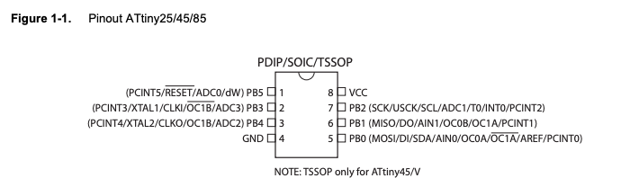
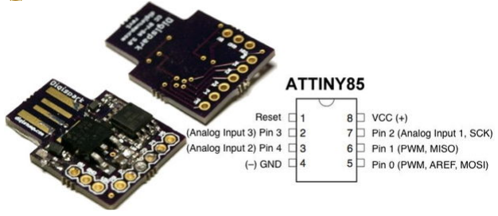

# Complete Digispark ATtiny85 Setup(macOS)
This guide is a complete guide to setting up the Digispark ATtiny85 board on macOS with the Arduino Uno as ISP and Arduino IDE.

## Prerequisites
- [Digispark ATtiny85](https://www.kickstarter.com/projects/digistump/digispark-the-tiny-arduino-enabled-usb-dev-board)
- [Arduino IDE](https://www.arduino.cc/en/software)
- [Arduino Uno](https://store.arduino.cc/products/arduino-uno-rev3)
- [avrdude](https://github.com/avrdudes/avrdude)
- [Micronucleus](https://github.com/micronucleus/micronucleus/releases)
- USB-A to USB-B Cable
- Breadboard
- Jumper Wires
- 10uF Capacitor


## Steps
1. [Install Arduino IDE](#1-install-arduino-ide)
0. [Turn Arduino Uno into ISP](#2-turn-arduino-uno-into-isp)
0. [Install avrdude](#3-install-avrdude)
0. [Connect Digispark ATtiny85 to Arduino Uno](#4-connect-digispark-attiny85-to-arduino-uno)
0. [Use avrdude CLI to burn bootloader to Digispark ATtiny85 with Arduino Uno as ISP](#5-use-avrdude-cli-to-burn-bootloader-to-digispark-attiny85-with-arduino-uno-as-isp)
0. [Verify firmware is burned to Digispark ATtiny85](#6-verify-firmware-is-burned-to-digispark-attiny85)
0. [Install Digispark AVR Boards in Arduino IDE](#7-install-digispark-avr-boards-in-arduino-ide)
0. [Verify Environment with Sample 'Blinking LED' Script](#8-verify-environment-with-sample-blinking-led-script)
0. [Upload and Execute Script](#9-upload-and-execute-script)


### 1. Install Arduino IDE

- Downloading the `.app`: https://www.arduino.cc/en/software
- Using Homebrew

```bash
$ brew install --cask arduino
```

### 2. Turn Arduino Uno into ISP
Connect your arduino uno via USB.
Go to file > examples > 11. ArduinoISP > ArduinoISP to open the ArduinoISP sketch.
Hit the arrow button to upload it to your arduino.
Now the arduino uno can act as an ISP for the Digispark ATtiny85.


### 3. Install avrdude

```bash
$ brew install avrdude
```

### 4. Connect Digispark ATtiny85 to Arduino Uno
First, examine the pinout of ATtiny85 according to the [datasheet](https://ww1.microchip.com/downloads/en/devicedoc/atmel-2586-avr-8-bit-microcontroller-ATtiny25-ATtiny45-ATtiny85_datasheet.pdf).



For the Digispark ATtiny85, the pin out matches the Port B pins of the ATtiny85.



Connect the Digispark ATtiny85 to the Arduino Uno as follows:

| Digispark ATtiny85 Pin | ATtiny85 PhysicalPin | Arduino GPIO/Pin | Function |
|:------------------:|:----------------:|:--------:|:--------:|
| VIN | 8 | 5v | 5V |
| GND | 4 | GND | GND |
| 0 | 5 | 11 | MOSI |
| 1 | 6 | 12 | MISO |
| 2 | 7 | 13 | SCK |
| 5 | 1 | 10 | RESET |

For example, connect Digispark ATtiny85 pin 0 to Arduino Uno pin 11, Digispark ATtiny85 pin 1 to Arduino Uno pin 12, etc.

Also connect a 10uF capacitor between arduino RST and arduino GND. Note that when using an electrolytic capacitor, put anode on RST and cathode on GND.

### 5. Use avrdude CLI to burn bootloader to Digispark ATtiny85 with Arduino Uno as ISP

Connect your arduino again via USB and go to Arduino IDE.

Under tools->port, take note of the port that your arduino uno is connected to.
The port will look like **/dev/cu.usbmodemXXXX** on macOS.

Open up your terminal, find where the avrdude config file is located.
```sh
$ which avrdude
```
If it's **/usr/local/bin/avrdude**, then look for **avrdudue.conf** in **/usr/local/Cellar/avrdude/<version>/.bottle/etc/avrdude.conf**

If it's **/opt/homebrew/bin/avrdude**, then look for **avrdudue.conf** in **/opt/homebrew/Cellar/avrdude/8.0/.bottle/etc**

Download the [t85_default.hex](https://github.com/micronucleus/micronucleus/blob/master/firmware/releases/t85_default.hex) file from the DigistumpArduino repo.

```sh
$ curl -L https://github.com/micronucleus/micronucleus/blob/master/firmware/releases/t85_default.hex -o t85_default.hex
```

Finally, set the environment variables and run the following command to burn the bootloader to the Digispark ATtiny85.
```sh
export AVRDUDE_PORT=<your_arduino_port>
export AVRDUDE_CONF=<path_to_avrdude_config_file>
avrdude -C $AVRDUDE_CONF \
-v -p t85 -c stk500v1 -P $AVRDUDE_PORT -b 19200 \
-U flash:w:t85_default.hex:i \
-U lfuse:w:0xe1:m -U hfuse:w:0xdd:m -U efuse:w:0xfe:m
```

Example:
```sh
export AVRDUDE_PORT=/dev/cu.usbmodem14201
export AVRDUDE_CONF=/usr/local/Cellar/avrdude/8.0/.bottle/etc/avrdude.conf
avrdude -C $AVRDUDE_CONF \
-v -p t85 -c stk500v1 -P $AVRDUDE_PORT -b 19200 \
-U flash:w:/path/to/t85_default.hex:i \
-U lfuse:w:0xe1:m -U hfuse:w:0xdd:m -U efuse:w:0xfe:m
```

Now the bootloader should be burned to the Digispark ATtiny85.

### 6. Verify firmware is burned to Digispark ATtiny85

Note that Micronucleus is only available for Intel chips.

Download the [Micronucleus tool](https://github.com/micronucleus/micronucleus/releases)(x86_64-Darwin.zip
 for intel chips), to verify the firmware is burned to the Digispark ATtiny85.

Unzip the file and run the following command to verify the firmware is burned to the Digispark ATtiny85.
```sh
./micronucleus --info
```


### 7. Install Digispark AVR Boards in Arduino IDE
1) Update board source

**digistump.com** has been down for a while, so we need to use the **github** mirror for the board manager.

In Arduino IDE, go to **File** -> **Preferences** and dump the following into the **Additional Boards Manager URLs** box:

[https://raw.githubusercontent.com/digistump/arduino-boards-index/master/package_digistump_index.json](https://raw.githubusercontent.com/digistump/arduino-boards-index/master/package_digistump_index.json)

In case that does not work too(you may get 404 error), you can try the following:

```sh
pip install fastapi uvicorn
uvicorn main:app --reload
```

This is going to firing up a simple local backend server that hosts the board manager index file.

Then paste the following into the **Additional Boards Manager URLs** box:

```sh
http://127.0.0.1:8000/package_digistump_index.json
```

You should be seeing Arduino IDE successfully fetching the board manager index file from your local server.

```sh
% uvicorn app:app --host 192.168.2.196 --reload
INFO:     Will watch for changes in these directories: ['/Users/taiy/Documents/GitHub/digispark-attiny85-setup']
INFO:     Uvicorn running on http://192.168.2.196:8000 (Press CTRL+C to quit)
INFO:     Started reloader process [49490] using StatReload
INFO:     Started server process [49513]
INFO:     Waiting for application startup.
INFO:     Application startup complete.
INFO:     192.168.2.250:49902 - "GET / HTTP/1.1" 404 Not Found
INFO:     192.168.2.250:49904 - "GET /package_digistump_index.json HTTP/1.1" 200 OK
INFO:     192.168.2.250:49544 - "GET /package_digistump_index.json HTTP/1.1" 200 OK
INFO:     192.168.2.250:49581 - "HEAD /package_digistump_index.json HTTP/1.1" 405 Method Not Allowed
INFO:     192.168.2.250:49581 - "GET /package_digistump_index.json HTTP/1.1" 200 OK
INFO:     192.168.2.250:49585 - "HEAD /package_digistump_index.json HTTP/1.1" 405 Method Not Allowed
INFO:     192.168.2.250:49585 - "GET /package_digistump_index.json HTTP/1.1" 200 OK
```

2) Install the Digistump AVR Boards
Still in Arduino IDE, go to **Tools** -> **Board** -> **Boards Manager**. From the **Type** dropdown, select **Contributed**. Select the **Digistump AVR Boards** package and click install.

3) Set the Digistump AVR Boards as the default board
Still in Arduino IDE, go to **Tools** -> **Board** -> **Digitump AVR Boards** -> **Digispark (Default - 16.5mhz)**.

### 8. Verify Environment with Sample 'Blinking LED' Script
1) Paste the following blinking LED script into the sketch present in Arduino IDE:

```sketch
void setup() {
    pinMode(1, OUTPUT);
}

void loop() {
    digitalWrite(1, HIGH);
    delay(1000);
    digitalWrite(1, LOW);
    delay(2000);
}
```

2) Verify the script before you upload it, by clicking "Verify" in the top-left corner (alternately, **Sketch** -> **Verify/compile**).

If all is well, you should see the following output in the console at the bottom:
```
Sketch uses 2700 bytes (44%) of program storage space. Maximum is 6012 bytes.
Global variables use 95 bytes of dynamic memory.
```

**NB**: However, if you experience the following error: 
```
fork/exec /Users/XXXXX/Library/Arduino15/packages/arduino/tools/avr-gcc/4.8.1-arduino5/bin/avr-g++: bad CPU type in executable
Error compiling for board Digispark (Default - 16.5mhz).
```

The solution is to substitute (link) the built-in, outdated AVR tools that Digistump config looks for, with the new, updated one included in the Arduino IDE (Thanks to user [Anjin from the Digistump boards](https://digistump.com/board/index.php/topic,3198.msg14379.html#msg14379)). It is done in the following way:

For Arduino IDE 1.x:
```bash
$ cd ~/Library/Arduino15/packages/arduino/tools/avr-gcc
$ mv 4.8.1-arduino5 orig.4.8.1
$ ln -s /Applications/Arduino.app/Contents/Java/hardware/tools/avr 4.8.1-arduino5
```

For Arduino IDE 2.x (thanks to [@jorgezazo](https://gist.github.com/dbdness/072b032ecbab80578730345dbe68fb5b?permalink_comment_id=4730896#gistcomment-4730896) and [vgenov-py](https://gist.github.com/dbdness/072b032ecbab80578730345dbe68fb5b?permalink_comment_id=4787674#gistcomment-4787674)):

```bash
$ cd ~/Library/Arduino15/packages/arduino/tools/avr-gcc 
$ mv 4.8.1-arduino5/ orig.4.8.1 
$ ln -s ~/Library/Arduino15/packages/arduino/tools/avr-gcc/7.3.0-atmel3.6.1-arduino7 4.8.1-arduino5
```

### 9. Upload and Execute Script
Once the script can be verified with no issues, get the Digispark ATtiny85 board, but do not plug it into your computer yet.


1. In the Arduino IDE, pick **Digispark (Default - 16.5mhz)** as the board.

0. In Tools->Programmer, select Micronucleus. This is very important, otherwise the bootloader will be overwritten and the next time you upload the script, you'll have to burn the bootloader again.

0. From the Arduino IDE, click "Upload" in the top left, and wait for the prompt: 

```
Running Digispark Uploader...
Plug in device now... (will timeout in 60 seconds)
```

2. Plug in the board and wait.

3. The following should be displayed in the Arduino console, and the script should self-execute on the machine:

```bash
> Device is found!
connecting: 16% complete
connecting: 22% complete
connecting: 28% complete
connecting: 33% complete
> Device has firmware version 1.6
> Available space for user applications: 6012 bytes
> Suggested sleep time between sending pages: 8ms
> Whole page count: 94  page size: 64
> Erase function sleep duration: 752ms
parsing: 50% complete
> Erasing the memory ...
erasing: 55% complete
erasing: 60% complete
erasing: 65% complete
> Starting to upload ...
writing: 70% complete
writing: 75% complete
writing: 80% complete
> Starting the user app ...
running: 100% complete
>> Micronucleus done. Thank you!
```